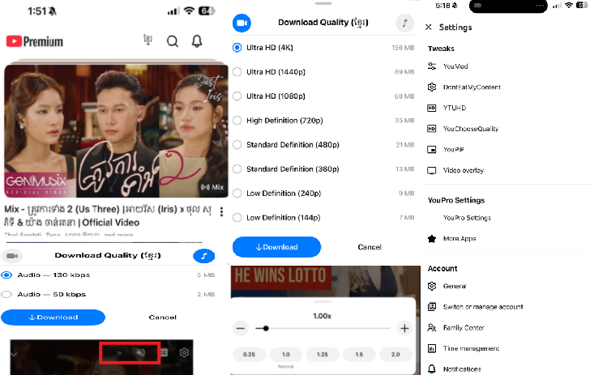

# YouProMod
YouProMod is a workflow customized YouTube mod from dev [Tonwalter888|YouMod](https://github.com/Tonwalter888/YouMod) and [Alibusut|YouPro](https://t.me/alibusut) offering enhanced playback, ad removal, a built-in download feature, and advanced options like Picture-in-Picture (PiP), gesture controls, and UI customization.  Feel free to fork and contribute.

  

# How to Build the YouProMod IPA

1. Fork the repository by clicking the **Fork** button in the top-right corner.
2. In your forked repository, go to **Settings → Actions**, and enable **Read and write permissions**.

3. Click **Sync fork**, and if your branch is outdated, select **Update branch**.

4. Navigate to the **Actions** tab in your forked repository and choose **Build YouProMod IPA**.

5. Click the **Run workflow** button on the right-hand side.

6. Obtain a decrypted `.ipa` file *(cannot be provided here due to legal reasons)*.

7. Upload the `.ipa` to a file hosting service such as **filebin.net**, **filemail.com**, **catbox.moe**, or **Dropbox** (recommended).

   • If using Dropbox, change the `dl=0` parameter in the shared link to `dl=1` to make it a direct download link.

8. Paste the **direct download URL** into the required field.

9. Leave all other settings as default, then click **Run workflow** to start the build process.

10. Wait for the workflow to complete.

11. Once finished, download the **YouProMod IPA** from the **Releases** section of your forked repository.

# Credits

[Tonwalter888](https://github.com/Tonwalter888)

[PoomSmart](https://github.com/PoomSmart)

[Alibusut](https://t.me/alibusut) / [ipastar](https://t.me/ipastar)

[Mark02-2012|YTLite.x](https://github.com/Mark02-2012/YTPlusM)

# Features Included

- YouPro
- YouMod
- YTUHD
- YouMute
- YouSpeed
- YouChooseQuality
- YouPiP
- YouGroupSettings
- YTVideoOverlayin 

### ✨ Changes

- Enabled **Show mute button** and **show speed button** in Video Overlay
- Enabled **YouChooseQuality** for WiFi, and WiFi w/Airplay to 2160p
- Add **ខ្មែរ** logo w/flag
- Enabled **Screen Rotation** in General
- Patched **YouMute** (persistent mute across feed & playlist playback; default muted on first launch)
- Enabled Hide Short Feed, Gesture control, Force MiniPlayer, and Hide Paid Promotion in **YouMod**
- Disabled **YouMod** Download Manager
- Disabled Use old quality picker in **YouMod**
- Remove some items from Downloader **YouMod**
- Added **YouProLangFix** (English UI for YouPro)
- Patched Sponsored in Feed for **YouMod Ads.x**

## Note

After sideloading, you need to force close (restart) the app twice to fix the UI issues
  
## Version

Latest confirmed: 21.19.02 
Device: iPhone 15 Pro Max (latest iOS) 
Confirmed Date: 05/11/2026
